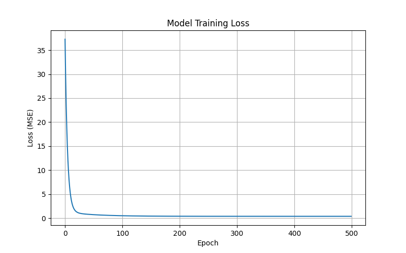

# Week 1: 강의 소개 및 환경 설정

## 📚 강의 목표

이 강의는 인공지능(AI)과 물리학의 만남을 주제로 합니다. Python과 딥러닝 프레임워크를 사용하여 물리학의 핵심 개념들을 시뮬레이션하고, AI가 이를 어떻게 학습하는지 탐구합니다.

**이번 주 목표:**
1. 개발 환경을 완벽하게 구축합니다. (Python, Git, VS Code/Cursor)
2. 최신 Python 패키지 관리 도구인 `uv` 사용법을 익힙니다.
3. AI 코딩 어시스턴트(Claude/Antigravity)와 협업하는 방법을 배웁니다.
4. **"Hello, Neural Network!"**: 첫 번째 인공지능 모델을 만들어 봅니다.

---

## 🛠️ 환경 설정 (Environment Setup)

이 수업에서는 최신 개발 트렌드에 맞춰 **Cursor** 에디터와 **uv** 패키지 매니저를 사용합니다.

### 1. Git 설치 (버전 관리)
Git은 코드의 역사를 기록하고 협업하는 도구입니다.
- **Windows**: [git-scm.com](https://git-scm.com/)에서 다운로드 및 설치 (기본 설정 유지)
- **설치 확인**: 터미널(PowerShell)에서 `git --version` 입력

### 2. Cursor 에디터 설치 (AI 기반 IDE)
VS Code 기반의 강력한 AI 에디터입니다.
- **다운로드**: [cursor.sh](https://cursor.sh/)
- **특징**: 내장된 AI(Claude/GPT-4)가 코드 작성, 디버깅, 설명을 도와줍니다. `Ctrl+K`나 `Ctrl+L`을 눌러 AI에게 말을 걸어보세요!

### 3. uv 설치 (초고속 Python 패키지 매니저)
Anaconda나 pip보다 훨씬 빠르고 가벼운 최신 도구입니다.
- **설치 (PowerShell)**:
  ```powershell
  powershell -c "irm https://astral.sh/uv/install.ps1 | iex"
  ```
- **설치 확인**: `uv --version`

---

## 🚀 프로젝트 시작하기

### 1. 프로젝트 폴더 생성
```bash
# 원하는 위치에 폴더 생성
mkdir aicoursework
cd aicoursework
```

### 2. Python 가상환경 설정 (uv 사용)
`uv`를 사용하면 프로젝트마다 독립적인 Python 환경을 아주 쉽게 만들 수 있습니다.

```bash
# 가상환경 생성 (현재 폴더에 .venv 생성)
uv venv

# 패키지 설치 (TensorFlow, Matplotlib 등)
uv pip install tensorflow numpy matplotlib
```

### 3. Cursor에서 열기
```bash
cursor .
```
이제 왼쪽 탐색기에서 파일들을 볼 수 있습니다.

---

## 🤖 AI Assistant 활용법

이 수업에서는 AI(Claude/Antigravity)를 적극적으로 활용합니다.

- **코드 설명 요청**: 코드를 드래그하고 "이 코드가 무슨 역할을 해?"라고 물어보세요.
- **에러 수정**: 에러 메시지를 복사해서 붙여넣으면 해결책을 알려줍니다.
- **코드 작성**: "y=2x-1을 학습하는 텐서플로우 코드를 짜줘"라고 요청해보세요.

> **Tip**: AI는 훌륭한 조수지만, 결과가 항상 100% 정확하지는 않습니다. AI가 짠 코드를 이해하고 검증하는 것이 여러분의 역할입니다!

---

## 👋 실습: Hello, Neural Network! (01_hello_nn.py)

첫 번째 신경망을 만들어 봅시다. 아주 간단한 수학 공식 `y = 2x - 1`을 데이터만 보고 스스로 깨우치게 할 것입니다.

### 코드 실행
```bash
# week1 폴더로 이동
cd week1

# 코드 실행 (uv run 사용)
uv run python 01_hello_nn.py
```

### 코드 분석

#### 1. 데이터 준비
```python
X = np.array([-1.0, 0.0, 1.0, 2.0, 3.0, 4.0], dtype=float)
y = np.array([-3.0, -1.0, 1.0, 3.0, 5.0, 7.0], dtype=float)
```
기계에게 규칙(`y=2x-1`)을 직접 알려주지 않고, 예시(데이터)만 줍니다.

#### 2. 모델 만들기
```python
model = tf.keras.Sequential([
    tf.keras.layers.Dense(units=1, input_shape=[1])
])
```
- **Dense**: 뉴런들이 서로 촘촘하게 연결된 층입니다.
- **units=1**: 뉴런 1개만 사용합니다. (문제가 단순하니까요!)
- **input_shape=[1]**: 입력값도 1개(x)입니다.

#### 3. 학습 (Training)
```python
model.compile(optimizer='sgd', loss='mean_squared_error')
model.fit(X, y, epochs=500)
```
- **SGD (확률적 경사 하강법)**: 정답을 찾아 산을 내려가는 방법입니다.
- **MSE (평균 제곱 오차)**: 예측값과 정답의 차이(에러)를 계산하는 방법입니다.
- **Epochs=500**: 500번 반복해서 학습합니다.

### 결과 확인
학습이 끝나면 `outputs/training_loss.png` 파일이 생성됩니다. 에러(Loss)가 0에 가깝게 줄어드는 것을 확인해보세요!



모델은 `w`(가중치)와 `b`(편향)를 스스로 찾아냅니다.
- **예상**: w=2.0, b=-1.0
- **실제**: 학습된 값은 이와 매우 비슷할 것입니다.

---

## 📝 과제
1. `01_hello_nn.py`를 실행하고 결과를 확인하세요.
2. 데이터 `X`와 `y`를 바꿔서 다른 공식(예: `y = 3x + 2`)을 학습시켜 보세요. 잘 맞추나요?
