# Week 11: 양자역학 시뮬레이션

## 📚 학습 목표

이번 주차에서는 양자역학의 핵심인 **슈뢰딩거 방정식**을 컴퓨터로 풀고, 양자 세계의 놀라운 현상들을 시각화하여 이해합니다. 수학적인 공식에 두려워하지 마세요! 우리는 컴퓨터가 대신 계산해주고, 그 결과를 아름다운 그림으로 볼 것입니다.

**배울 내용:**
1. 슈뢰딩거 방정식이란 무엇인가?
2. 파동함수와 확률의 개념
3. 터널링 효과 - 벽을 통과하는 입자!
4. 양자 우물과 조화 진동자
5. 고전 물리학 vs 양자 물리학

---

## 🌟 양자역학이란?

### 왜 양자역학이 필요한가?

우리가 일상에서 경험하는 물리학(고전 물리학)은 다음과 같은 것들을 설명합니다:
- 공을 던지면 어디로 떨어질까?
- 자동차가 브레이크를 밟으면 언제 멈출까?
- 진자가 어떻게 흔들릴까?

하지만 **아주 작은 세계**(원자, 전자, 광자)에서는 이상한 일들이 벌어집니다:
- 입자가 벽을 통과한다 (터널링)
- 입자가 동시에 여러 곳에 존재한다 (중첩)
- 입자의 위치와 속도를 동시에 정확히 알 수 없다 (불확정성 원리)

양자역학은 이런 **미시 세계의 물리학**입니다.

### 파동함수(Wave Function) - ψ(x)

양자역학의 핵심은 **파동함수** ψ(x,t) 입니다:
- **고전 물리학**: "입자는 x=3 위치에 있다"
- **양자역학**: "입자는 확률적으로 여러 곳에 있을 수 있다. ψ(x)가 그 확률을 알려준다"

파동함수의 해석:
- ψ(x) 자체는 복소수 (실수부 + 허수부)
- **|ψ(x)|² = 확률 밀도** (입자가 x 위치에서 발견될 확률)
- ψ(x)가 큰 곳 → 입자를 발견할 확률이 높다
- ψ(x)가 0인 곳 → 입자를 절대 발견할 수 없다

---

## 📐 슈뢰딩거 방정식

### 시간 독립 슈뢰딩거 방정식

입자의 파동함수를 구하는 방정식:

```
-ℏ²/2m · d²ψ/dx² + V(x)ψ = Eψ
```

**각 항의 의미:**
- `ℏ` (h-bar): 플랑크 상수 / 2π ≈ 1.055 × 10⁻³⁴ J·s (매우 작은 수!)
- `m`: 입자의 질량
- `V(x)`: 포텐셜 에너지 (입자가 느끼는 힘의 장)
- `E`: 입자의 총 에너지
- `ψ(x)`: 파동함수 (우리가 구하려는 것!)
- `d²ψ/dx²`: 2차 미분 (파동함수의 곡률)

**물리적 의미:**
- 왼쪽 항 = 입자의 총 에너지 (운동에너지 + 포텐셜에너지)
- 오른쪽 항 = 에너지 상수 × 파동함수

### 컴퓨터로 어떻게 풀까?

슈뢰딩거 방정식을 손으로 풀기는 매우 어렵습니다. 하지만 컴퓨터는 **유한 차분법(Finite Difference Method)**을 사용하여 쉽게 풀 수 있습니다:

1. **공간을 작은 조각으로 나눔**: x = [0, 0.01, 0.02, ..., 10]
2. **2차 미분을 근사**: d²ψ/dx² ≈ (ψ(x+dx) - 2ψ(x) + ψ(x-dx)) / dx²
3. **행렬 고유값 문제로 변환**: Hψ = Eψ
4. **고유값(E)과 고유벡터(ψ) 찾기**: NumPy/SciPy가 자동으로 계산!

---

## 🔬 실습 1: 슈뢰딩거 방정식 풀기 (01schrodinger.py)

### 프로그램 개요

이 프로그램은 세 가지 대표적인 포텐셜에서 슈뢰딩거 방정식을 풉니다:

#### 1. 무한 사각 우물 (Infinite Square Well)

**개념:**
- 상자 안에 갇힌 입자를 상상해보세요
- 상자 벽은 무한히 높아서 입자가 절대 빠져나갈 수 없습니다
- 입자는 상자 안에서만 움직입니다

**포텐셜:**
```
V(x) = 0   (0 < x < L, 상자 안)
V(x) = ∞   (x ≤ 0 or x ≥ L, 상자 밖)
```

**결과 해석:**
- 에너지가 양자화됩니다: E₁, E₂, E₃, ... (임의의 에너지 불가능!)
- n이 클수록 (높은 에너지) 파동함수가 더 많이 진동합니다
- 낮은 n: 에너지가 낮고, 파동함수가 부드럽다
- 높은 n: 에너지가 높고, 파동함수가 복잡하다

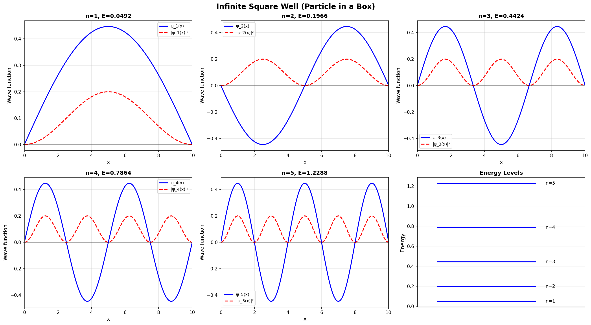

**그림 읽기:**
- **위**: 포텐셜 에너지 V(x)와 에너지 준위 (E₀, E₁, E₂, E₃)
- **아래**: 각 에너지 준위의 파동함수
  - 실선: 파동함수 ψ(x)
  - 점선: 에너지 준위
  - 파동함수가 0을 지나는 점: 노드(node) - 입자를 발견할 수 없는 위치!

**물리적 의미:**
- 에너지 공식: Eₙ = n²π²ℏ² / (2mL²)
- n=1 (바닥 상태): 에너지가 최소이지만 0이 아님! (영점 에너지)
- n이 2배가 되면 에너지는 4배가 됨

---

#### 2. 조화 진동자 (Harmonic Oscillator)

**개념:**
- 용수철에 매달린 공을 상상해보세요
- V(x) = ½kx² (포물선 모양)
- 평형점(x=0)에서 멀어질수록 복원력이 강해집니다

**응용 예:**
- 분자의 진동
- 양자 광학
- 양자 컴퓨터의 큐비트

**결과 해석:**
- 에너지가 등간격으로 양자화: Eₙ = ℏω(n + ½)
- 모든 준위 사이의 에너지 차이가 같습니다!
- 고전적 전환점: 공이 멈추고 되돌아오는 위치

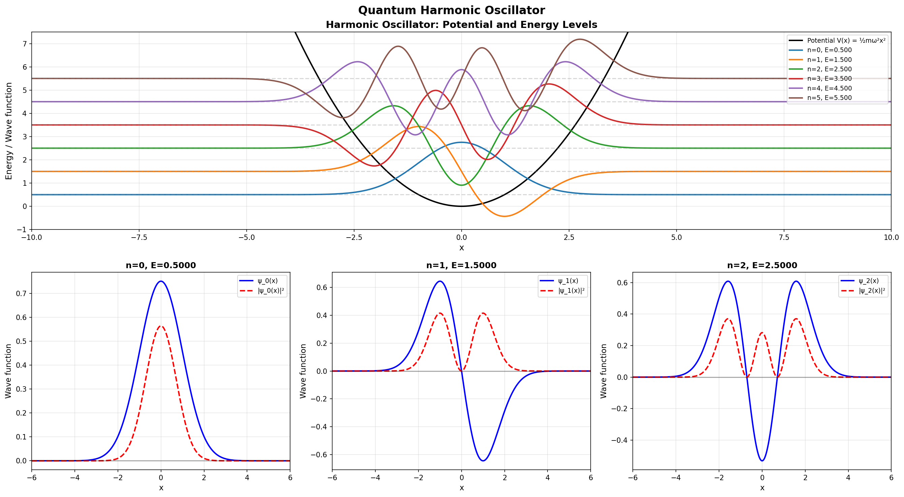

**그림 읽기:**
- **빨간 점선**: 고전적 전환점 (고전 입자는 여기를 넘어갈 수 없음)
- **파동함수**: 전환점 밖으로도 약간 튀어나옴 (양자 터널링!)
- **가우시안 분포**: n이 커질수록 고전 물리학에 가까워짐

---

#### 3. 유한 사각 우물 (Finite Square Well)

**개념:**
- 무한 우물과 비슷하지만 벽이 유한한 높이
- 입자가 벽 밖으로 약간 튀어나올 수 있습니다!

**포텐셜:**
```
V(x) = -V₀  (우물 안)
V(x) = 0    (우물 밖)
```

**결과 해석:**
- 입자가 고전적으로 금지된 영역에도 존재 가능!
- 에너지가 높을수록 밖으로 많이 튀어나옴
- 터널링의 기초가 되는 현상

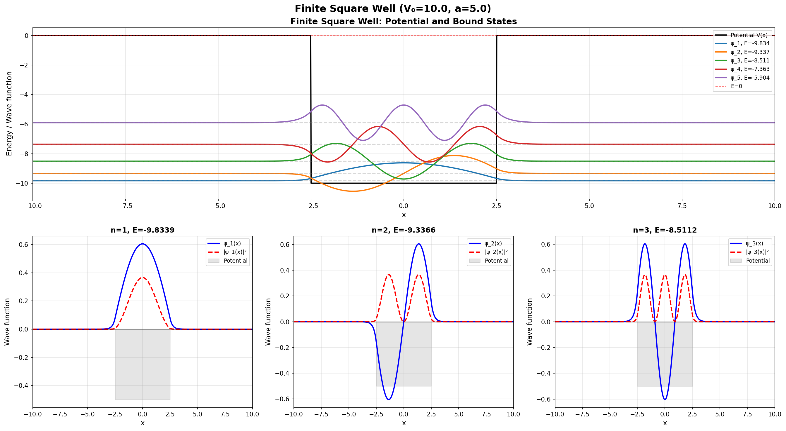

**그림 읽기:**
- **회색 영역**: 고전적으로 금지된 영역 (E < V)
- **파동함수의 꼬리**: 금지된 영역으로 침투!
- 에너지가 낮을수록 꼬리가 짧음

---

### 프로그램 실행 방법

```bash
# week11 디렉토리로 이동
cd week11

# 프로그램 실행
uv run python 01schrodinger.py
```

**출력:**
```
======================================================================
Schrödinger Equation Numerical Solver
======================================================================

======================================================================
1. Infinite Square Well (L=10.0)
======================================================================
- 슈뢰딩거 방정식을 풀어 에너지 준위와 파동함수를 계산합니다...
- 최저 5개 에너지 준위:
  E₀ = 0.049 (Ground State)
  E₁ = 0.197
  E₂ = 0.443
  E₃ = 0.789
  E₄ = 1.233
✓ 저장: outputs/01_infinite_square_well.png

...
```

### 핵심 코드 이해

```python
# 해밀토니안 행렬 생성 (운동에너지 + 포텐셜에너지)
def create_hamiltonian(x, V):
    N = len(x)
    dx = x[1] - x[0]
    
    # 운동 에너지 항 (2차 미분을 행렬로 표현)
    T = np.zeros((N, N))
    for i in range(N):
        if i > 0:
            T[i, i-1] = -1  # 왼쪽 이웃
        T[i, i] = 2         # 자기 자신
        if i < N-1:
            T[i, i+1] = -1  # 오른쪽 이웃
    
    T = T * hbar**2 / (2 * m * dx**2)
    
    # 포텐셜 에너지 항 (대각 행렬)
    V_matrix = np.diag(V)
    
    # 전체 해밀토니안
    H = T + V_matrix
    
    return H

# 고유값과 고유벡터 구하기
eigenvalues, eigenvectors = eigh(H)

# 에너지와 파동함수
E = eigenvalues[:5]  # 최저 5개 에너지
psi = eigenvectors[:, :5]  # 해당 파동함수
```

---

## 🌊 실습 2: 파동함수 시각화 (02wavefunction.py)

### 프로그램 개요

파동함수의 다양한 형태와 시간에 따른 변화를 시각화합니다.

#### 1. 가우시안 파동 패킷 (Gaussian Wave Packet)

**개념:**
- 특정 위치 근처에 국소화된 입자
- 실제 입자는 정확한 위치가 아니라 확률 분포로 존재
- 시간이 지나면 퍼져나갑니다 (분산)

**수학적 표현:**
```
ψ(x,0) = exp(-(x-x₀)²/4σ²) · exp(ik₀x)
```

- `σ`: 파동 패킷의 너비 (위치 불확정성)
- `k₀`: 평균 운동량 (p = ℏk₀)
- **불확정성 원리**: Δx · Δp ≥ ℏ/2

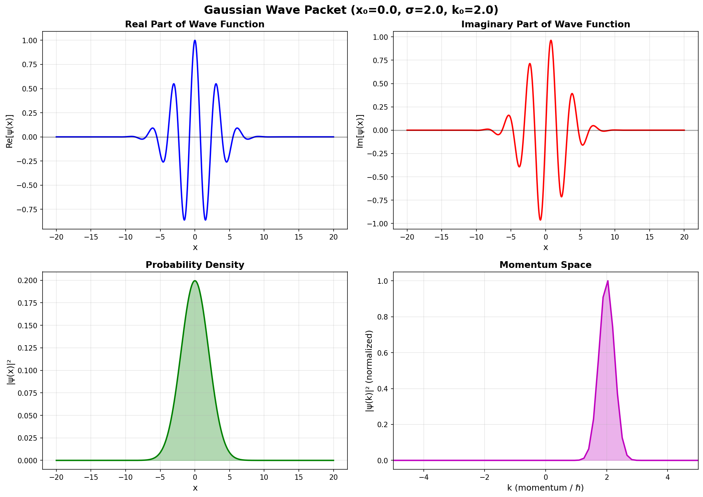

**그림 읽기:**
- **실수부 (파란색)**: 파동함수의 실수 부분
- **허수부 (주황색)**: 파동함수의 허수 부분
- **확률 밀도 (녹색)**: |ψ|² - 입자를 발견할 확률
- **위상 (빨간색)**: 파동의 위상 (arg(ψ))

**관찰 포인트:**
- 확률 밀도는 항상 양수
- 실수부와 허수부는 진동하며 간섭
- 운동량 k₀가 있으면 파동이 이동함

---

#### 2. 중첩 상태 (Superposition States)

**개념:**
- 양자역학의 핵심: 입자가 여러 상태에 동시에 존재!
- ψ = c₁ψ₁ + c₂ψ₂ + c₃ψ₃ + ...
- 측정하면 하나의 상태로 "붕괴"

**예시: 무한 우물의 중첩**
```python
# n=1과 n=3 상태의 중첩
ψ = (ψ₁ + ψ₃) / √2
```

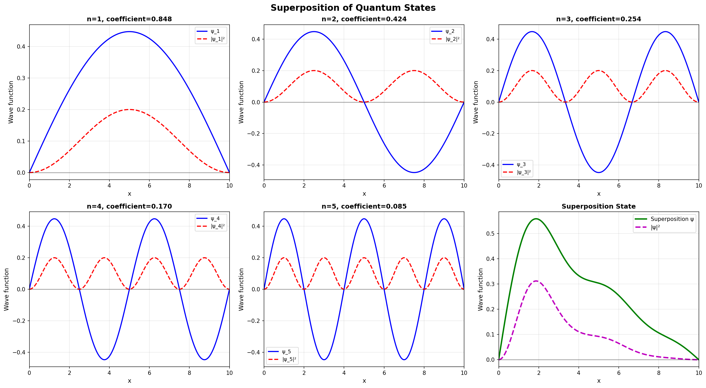

**그림 읽기:**
- **n=1 + n=3**: 두 상태의 간섭으로 비대칭 분포
- **n=1 + n=5**: 더 복잡한 간섭 패턴
- **동등 중첩**: 모든 확률이 똑같이 분산

**물리적 의미:**
- 슈뢰딩거의 고양이 역설과 같은 원리
- 양자 컴퓨터의 기본 원리 (큐비트)
- 측정 전까지는 모든 상태의 중첩!

---

#### 3. 수소 원자 오비탈 (Hydrogen Atom Orbitals)

**개념:**
- 전자가 원자핵 주위에 존재하는 영역
- 1s, 2s, 2p, 3s, ... (양자수 n, l로 구분)
- 화학의 기초!

**양자수:**
- **n** (주 양자수): 에너지 준위 (1, 2, 3, ...)
- **l** (각운동량 양자수): 모양 (0=s, 1=p, 2=d, ...)
- **m** (자기 양자수): 방향 (-l, ..., 0, ..., +l)

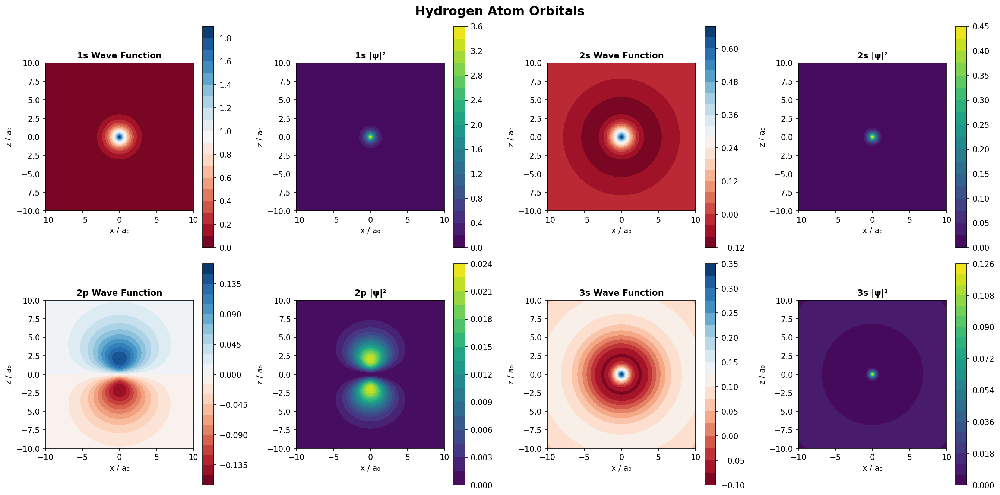

**오비탈 특징:**
- **1s**: 구형 대칭, 중심에 최대 확률
- **2s**: 구형 대칭, 노드 1개 (전자가 없는 구면)
- **2p**: 아령 모양, 각도 의존성
- **3s**: 구형 대칭, 노드 2개

**화학적 의미:**
- 원자가 오비탈: 화학 결합의 기초
- s 오비탈: 구형 → 비방향성
- p 오비탈: 방향성 → 분자 모양 결정

---

### 프로그램 실행 방법

```bash
uv run python 02wavefunction.py
```

**출력:**
```
======================================================================
Wave Function Visualization
======================================================================

======================================================================
1. Gaussian Wave Packet
======================================================================
가우시안 파동 패킷 시각화:
  중심 위치: 0.0
  너비 (σ): 2.0
  평균 운동량 (k₀): 2.0
✓ 저장: outputs/02_gaussian_wave_packet.png

...
```

---

## 🚇 실습 3: 터널링 효과 (03tunneling.py)

### 양자 터널링이란?

**고전 물리학:**
- 공을 언덕 위로 던집니다
- 공의 에너지 < 언덕 높이 → 공은 절대 넘어갈 수 없음

**양자 물리학:**
- 입자의 에너지 < 장벽 높이
- 그런데도 입자가 장벽을 "통과"합니다!
- 확률은 작지만 0이 아님

**터널링이 일어나는 곳:**
- 반도체 소자 (터널 다이오드)
- 핵융합 (태양이 빛나는 이유!)
- DNA 돌연변이
- 주사 터널링 현미경 (STM)

---

### 1. 사각 장벽 터널링

**개념:**
- 장벽 높이: V₀
- 장벽 너비: a
- 입자 에너지: E < V₀

**투과 확률 (T):**
```
T ≈ exp(-2κa)
κ = √(2m(V₀-E)/ℏ²)
```

- 장벽이 두꺼울수록 (a ↑) → T 감소
- 장벽이 높을수록 (V₀ ↑) → T 감소
- 입자가 무거울수록 (m ↑) → T 감소

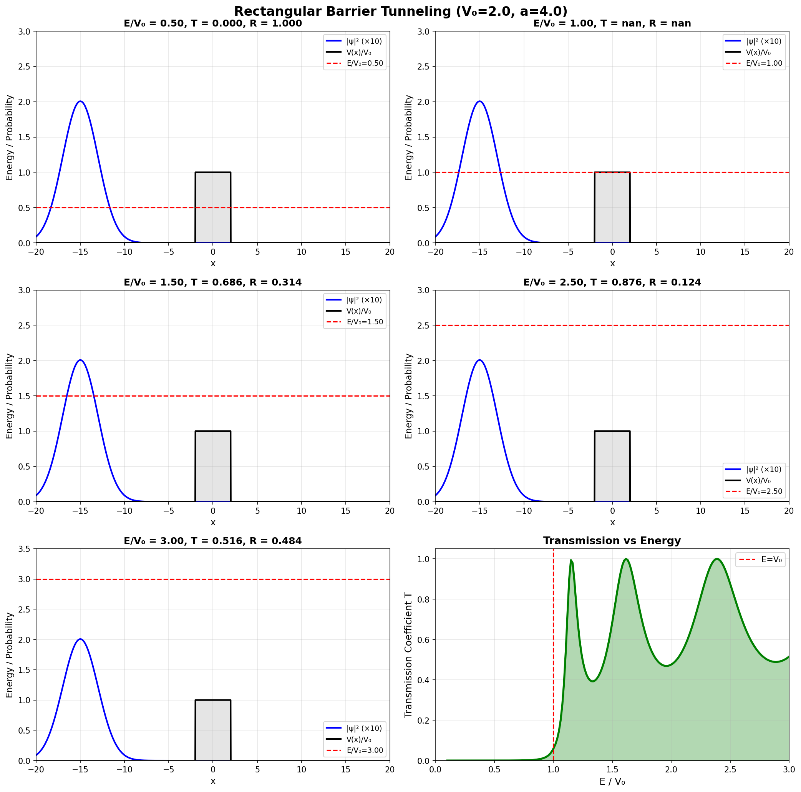

**그림 읽기:**
- **왼쪽**: 입사파 (incident wave) - 들어오는 입자
- **장벽 안**: 파동함수가 지수적으로 감소
- **오른쪽**: 투과파 (transmitted wave) - 통과한 입자 (작음!)
- **반사파**: 튕겨 나간 입자

**에너지 의존성:**
- E ≈ V₀ (에너지가 장벽에 가까움): 투과 확률 급증
- E << V₀: 거의 터널링 불가능

---

### 2. 공명 터널링 (Resonant Tunneling)

**개념:**
- 두 개의 장벽이 양자 우물을 형성
- 특정 에너지에서 투과 확률이 1에 가까워짐!
- 공명 상태 (Resonance)

**응용:**
- 공명 터널링 다이오드 (RTD)
- 초고속 스위칭 소자
- 양자 캐스케이드 레이저

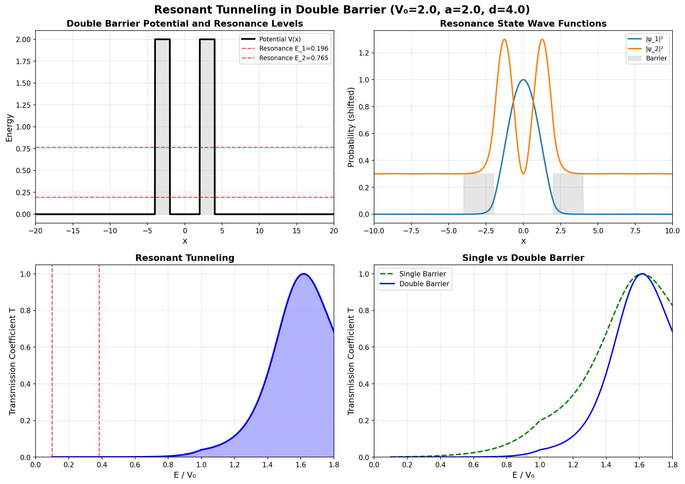

**그림 읽기:**
- **우물 안의 정상파**: 공명 조건 만족
- **투과율 vs 에너지**: 특정 에너지에서 피크
- **공명 에너지**: 우물 안의 준위 에너지와 일치

---

### 3. 터널링 매개변수 의존성

**실험 변수:**
1. **장벽 높이 (V₀)**
2. **장벽 너비 (a)**
3. **입자 에너지 (E)**

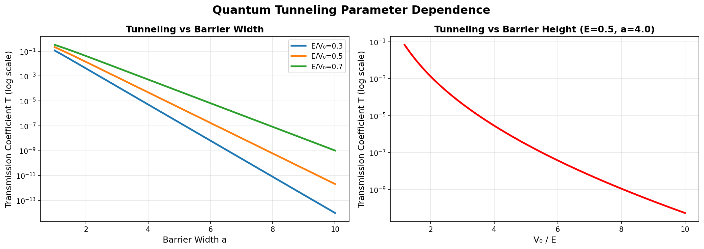

**관찰 포인트:**
- 장벽 높이 증가 → 투과율 지수적 감소
- 장벽 너비 증가 → 투과율 지수적 감소
- 입자 에너지 증가 → 투과율 증가

---

### 프로그램 실행 방법

```bash
uv run python 03tunneling.py
```

**출력:**
```
======================================================================
Quantum Tunneling Effect Simulation
======================================================================

======================================================================
1. Rectangular Barrier Tunneling
======================================================================
사각 장벽 터널링 시뮬레이션:
  장벽 높이: 2.0
  장벽 너비: 2.0
  입자 에너지: 0.5, 1.0, 1.5
✓ 저장: outputs/03_rectangular_barrier.png

...
```

---

## ⚛️ 실습 4: 유한 우물과 조화 진동자 상세 분석 (04wells_oscillator.py)

### 프로그램 개요

양자역학의 대표적인 포텐셜에서의 파동함수와 에너지 준위를 상세히 분석합니다.

#### 1. 유한 우물의 깊이 의존성

**개념:**
- 우물 깊이 V₀를 변화시키면 에너지 준위가 어떻게 변할까?
- 얕은 우물: 에너지 준위가 적음
- 깊은 우물: 에너지 준위가 많음

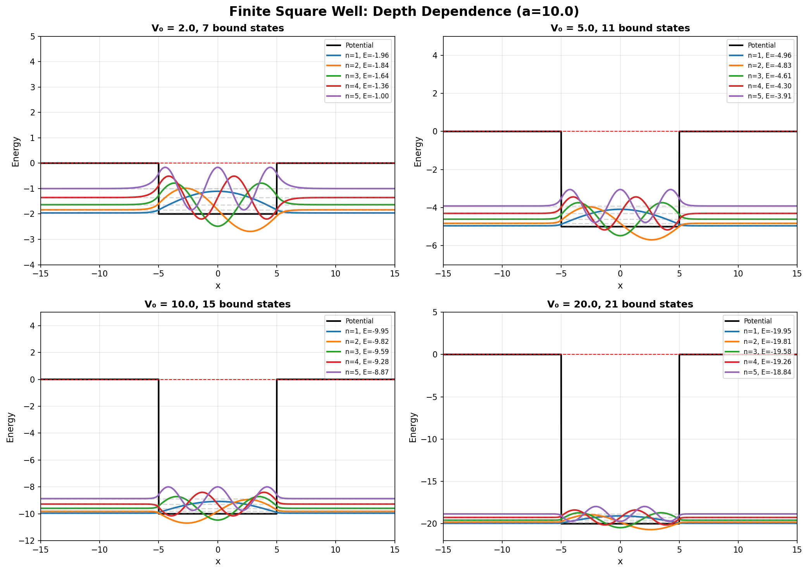

**물리적 의미:**
- V₀ 증가 → 더 많은 속박 상태 (bound states)
- 각 준위의 에너지도 낮아짐 (더 강하게 속박)
- V₀ → ∞: 무한 우물로 수렴

---

#### 2. 유한 우물의 너비 의존성

**개념:**
- 우물 너비 L을 변화시키면?
- 좁은 우물: 에너지가 높음 (불확정성 원리!)
- 넓은 우물: 에너지가 낮음


**불확정성 원리:**
```
Δx · Δp ≥ ℏ/2
```
- 우물이 좁으면 (Δx 작음) → Δp 커짐 → 에너지 증가!
- 나노 구조에서 중요: 양자점, 양자선

---

#### 3. 조화 진동자 상세 분석

**개념:**
- 가장 중요한 양자 시스템!
- 정확한 해석해가 존재
- 에너지: Eₙ = ℏω(n + ½)

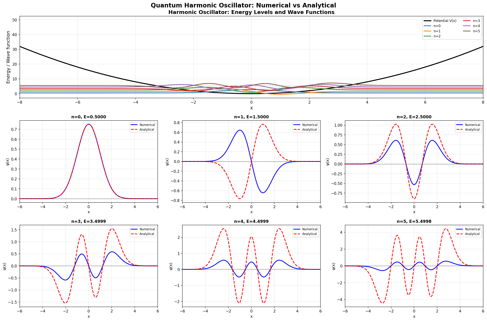

**특징:**
- **에르미트 다항식**: 파동함수의 형태 결정
- **등간격 에너지**: 모든 준위가 ℏω 차이
- **대칭성**: 우함수(짝수 n) / 기함수(홀수 n)

**양자-고전 대응:**
- 낮은 n: 순수 양자 효과
- 높은 n: 고전 진동에 가까워짐 (보어 대응 원리)

---

#### 4. 양자 우물 비교

**세 가지 우물 비교:**
1. **무한 우물**: 벽이 무한히 높음
2. **유한 우물**: 벽이 유한한 높이
3. **조화 진동자**: 포물선 포텐셜

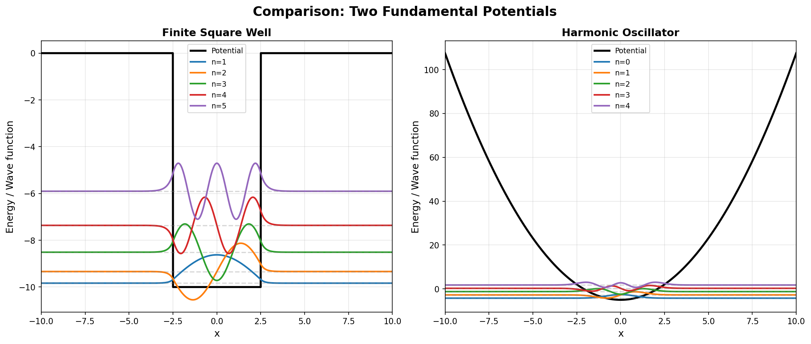

**비교 포인트:**
- **에너지 간격**: 무한 우물(불균등), 조화 진동자(균등)
- **파동함수 형태**: 각각 독특한 패턴
- **고전적 전환점**: 조화 진동자에서 명확

---

#### 5. 고전 vs 양자

**고전 입자 vs 양자 입자:**

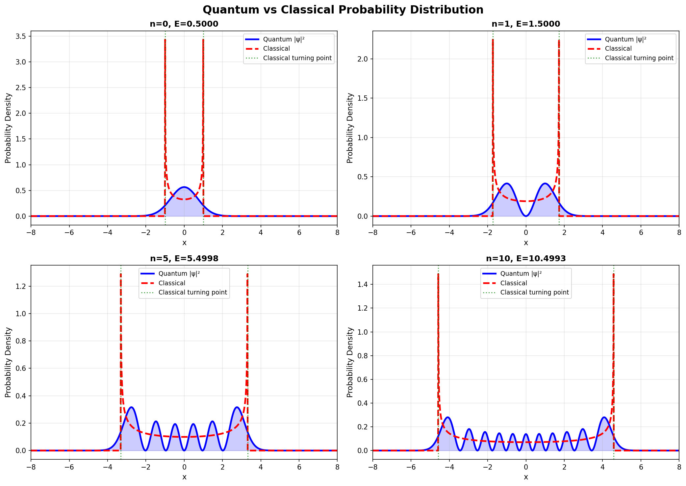

**주요 차이:**

| 특성 | 고전 물리학 | 양자 물리학 |
|-----|-----------|-----------|
| 위치 | 정확한 점 | 확률 분포 (ψ²) |
| 에너지 | 연속적 | 양자화 (E₀, E₁, ...) |
| 최소 에너지 | 0 | 영점 에너지 > 0 |
| 터널링 | 불가능 | 가능! |
| 금지 영역 | 절대 불가 | 확률은 작지만 존재 |

**고전 극한 (Correspondence Principle):**
- n이 크면 (높은 에너지) → 양자 → 고전
- 거시 세계에서는 양자 효과가 평균화되어 사라짐

---

### 프로그램 실행 방법

```bash
uv run python 04wells_oscillator.py
```

**출력:**
```
======================================================================
Finite Well & Harmonic Oscillator Analysis
======================================================================

======================================================================
1. Finite Square Well - Depth Dependence
======================================================================
유한 사각 우물의 깊이(V₀) 의존성 분석:
  V₀ = 5.0, 10.0, 20.0
  각 깊이에서 에너지 준위 개수와 파동함수 계산
✓ 저장: outputs/04_finite_well_depth.png

...
```

---

## 🎯 핵심 개념 정리

### 1. 양자화 (Quantization)

**무엇이 양자화되는가?**
- **에너지**: E₀, E₁, E₂, ... (연속적이지 않음!)
- **각운동량**: L = √(l(l+1))ℏ
- **스핀**: ±ℏ/2

**왜 양자화되는가?**
- 경계 조건: 파동함수가 0 또는 연속
- 정상파 조건: 파동이 자기 자신과 간섭
- 수학적: 고유값 문제의 해

---

### 2. 터널링 (Tunneling)

**핵심 아이디어:**
- 에너지가 부족해도 장벽을 통과!
- 확률적 현상: 100% 아님

**투과 확률:**
- 지수적 감소: T ∝ exp(-2κa)
- 장벽의 높이, 너비, 입자 질량에 의존

**응용:**
- 알파 붕괴 (방사성 동위원소)
- 핵융합 (별의 에너지원)
- 반도체 소자 (터널 다이오드, Flash 메모리)

---

### 3. 파동-입자 이중성 (Wave-Particle Duality)

**입자인가? 파동인가?**
- **둘 다!**
- 측정 전: 파동 (간섭, 회절)
- 측정 후: 입자 (특정 위치에서 발견)

**드브로이 파장:**
```
λ = h/p = 2πℏ/p
```
- 운동량이 크면 → 파장이 짧음
- 거시 물체: 파장이 너무 짧아서 파동성 관측 불가

---

### 4. 불확정성 원리 (Uncertainty Principle)

**하이젠베르크 불확정성 원리:**
```
Δx · Δp ≥ ℏ/2
ΔE · Δt ≥ ℏ/2
```

**의미:**
- 위치를 정확히 알면 → 운동량을 모름
- 운동량을 정확히 알면 → 위치를 모름
- **측정의 문제가 아님**: 근본적인 자연의 법칙!

**예시:**
- 전자의 위치를 좁은 공간에 가두면 (Δx 작음) → 운동량 불확정성 증가 (Δp 큼) → 에너지 증가!

---

## 🔧 프로그래밍 테크닉

### 유한 차분법 (Finite Difference Method)

**미분을 근사:**

```python
# 1차 미분
df/dx ≈ (f(x+dx) - f(x-dx)) / (2*dx)

# 2차 미분
d²f/dx² ≈ (f(x+dx) - 2*f(x) + f(x-dx)) / dx²
```

**행렬로 표현:**

```python
# 2차 미분 행렬 (N×N)
T = np.zeros((N, N))
for i in range(N):
    if i > 0:
        T[i, i-1] = -1
    T[i, i] = 2
    if i < N-1:
        T[i, i+1] = -1

T = T / dx**2
```

---

### 고유값 문제 풀기

**슈뢰딩거 방정식:**
```
Hψ = Eψ
```
→ 고유값 문제!

**NumPy/SciPy로 풀기:**

```python
from scipy.linalg import eigh

# 고유값(에너지)과 고유벡터(파동함수)
eigenvalues, eigenvectors = eigh(H)

# 정렬 (낮은 에너지부터)
idx = eigenvalues.argsort()
E = eigenvalues[idx]
psi = eigenvectors[:, idx]
```

---

### 파동함수 정규화

**확률 해석:**
```
∫|ψ(x)|² dx = 1
```

**코드:**

```python
# 정규화
norm = np.sqrt(np.sum(np.abs(psi)**2) * dx)
psi = psi / norm

# 확인
probability = np.sum(np.abs(psi)**2) * dx
print(f"총 확률: {probability:.6f}")  # 1.000000
```

---

## 📊 시각화 팁

### Matplotlib 커스터마이징

**한국어 폰트 설정:**

```python
plt.rcParams['font.family'] = 'Malgun Gothic'  # Windows
plt.rcParams['axes.unicode_minus'] = False  # 마이너스 기호 깨짐 방지
```

**서브플롯 레이아웃:**

```python
from matplotlib.gridspec import GridSpec

fig = plt.figure(figsize=(15, 10))
gs = GridSpec(3, 2, figure=fig, hspace=0.3, wspace=0.3)

ax1 = fig.add_subplot(gs[0, :])  # 첫 행 전체
ax2 = fig.add_subplot(gs[1, 0])  # 두 번째 행 왼쪽
ax3 = fig.add_subplot(gs[1, 1])  # 두 번째 행 오른쪽
```

**음영 영역 (금지 영역):**

```python
# E < V인 영역을 회색으로
forbidden = np.where(V > E)[0]
ax.fill_between(x[forbidden], -1, 1, alpha=0.2, color='gray',
                label='Classically Forbidden')
```

---

## 💡 물리적 직관 기르기

### 양자역학을 이해하는 핵심 질문

1. **에너지가 왜 양자화되는가?**
   - 답: 경계 조건 때문! 파동이 자기 자신과 맞아떨어져야 함

2. **터널링이 왜 일어나는가?**
   - 답: 파동함수가 장벽에서 급격히 0이 되지 않고 지수적으로 감소

3. **왜 영점 에너지가 존재하는가?**
   - 답: 불확정성 원리! 에너지가 0이면 위치와 운동량 모두 0 → 불확정성 원리 위배

4. **고전 극한은 언제 타당한가?**
   - 답: ℏ → 0 극한 (실제로는 n → ∞)

---

## 🚀 추가 학습 자료

### 추천 도서

1. **초급**
   - "양자역학의 선물" - 이해진
   - "파인만의 QED" - 리처드 파인만

2. **중급**
   - "Griffiths 양자역학" - David J. Griffiths
   - "양자역학 강의" - 이휘소

3. **고급**
   - "양자역학의 원리" - P.A.M. 디랙
   - "Sakurai 현대 양자역학" - J.J. Sakurai

### 온라인 강의

- MIT OCW: Quantum Physics I, II, III
- Stanford: Quantum Mechanics for Scientists and Engineers
- Coursera: Introduction to Quantum Mechanics

### 시뮬레이션 도구

- **PhET**: 콜로라도 대학의 물리 시뮬레이션
- **Quantum ESPRESSO**: 고급 양자 시뮬레이션
- **QuTiP**: Python 양자 툴킷

---

## 🔬 심화 프로젝트 아이디어

### 1. 시간 의존 슈뢰딩거 방정식

**목표:** 파동 패킷이 시간에 따라 어떻게 진화하는지 애니메이션

**방법:**
- 크랭크-니콜슨 방법 (Crank-Nicolson)
- Split-operator method
- 시간 진화 연산자: exp(-iHt/ℏ)

---

### 2. 2D/3D 슈뢰딩거 방정식

**목표:** 수소 원자의 3D 오비탈 시각화

**방법:**
- 구면 좌표계 (r, θ, φ)
- 구면 조화 함수 (Spherical Harmonics)
- 3D 등밀도 표면 (isosurface)

---

### 3. 다체 문제 (Many-Body Problem)

**목표:** 헬륨 원자 (전자 2개)

**방법:**
- Hartree-Fock 방법
- 변분법 (Variational Method)
- 몬테카를로 (Quantum Monte Carlo)

---

### 4. 산란 문제 (Scattering)

**목표:** 입자가 포텐셜을 만날 때 산란 단면적 계산

**방법:**
- 위상 이동 (Phase Shift)
- S-행렬 (S-Matrix)
- 부분파 전개 (Partial Wave Expansion)

---

## ❓ 자주 묻는 질문 (FAQ)

### Q1: 파동함수는 실제로 존재하는가?

**A:** 파동함수 자체는 관측 불가능합니다. 하지만 |ψ|²는 측정 가능한 확률 분포를 예측합니다. 파동함수는 "수학적 도구"이지만, 그 예측은 실험과 완벽히 일치합니다.

---

### Q2: 왜 측정하면 파동함수가 붕괴하는가?

**A:** "측정 문제"는 양자역학의 가장 큰 미스터리입니다. 여러 해석이 있습니다:
- **코펜하겐 해석**: 측정이 파동함수를 붕괴시킴
- **다세계 해석**: 모든 가능성이 다른 우주에서 실현됨
- **디코히어런스**: 환경과의 상호작용이 고전적 행동을 만듦

---

### Q3: 양자 컴퓨터는 어떻게 작동하는가?

**A:** 양자 컴퓨터는 중첩과 얽힘을 이용합니다:
- **중첩**: 큐비트가 0과 1을 동시에 표현
- **얽힘**: 큐비트들이 서로 연결
- **병렬성**: 2ⁿ개의 상태를 동시에 처리

하지만 측정하면 하나의 결과만 얻으므로, 교묘한 알고리즘이 필요합니다.

---

### Q4: 거시 세계에서 왜 양자 효과가 안 보이는가?

**A:** 
1. **디코히어런스**: 환경과의 상호작용이 양자 중첩을 파괴
2. **파장**: 거시 물체의 드브로이 파장이 너무 짧음
3. **평균화**: 엄청나게 많은 입자의 양자 효과가 평균화됨

---

### Q5: 양자역학은 결정론적인가?

**A:** 
- **파동함수 진화**: 결정론적 (슈뢰딩거 방정식)
- **측정 결과**: 확률적 (보른 규칙)

따라서 양자역학은 "확률론적 결정론"입니다.

---

## 🎓 학습 체크리스트

### 기본 개념

- [ ] 슈뢰딩거 방정식의 의미를 이해했는가?
- [ ] 파동함수 ψ와 확률 밀도 |ψ|²의 차이를 아는가?
- [ ] 양자화(Quantization)가 무엇인지 설명할 수 있는가?
- [ ] 불확정성 원리를 자신의 말로 설명할 수 있는가?

### 응용 개념

- [ ] 터널링 효과를 이해하고 예시를 들 수 있는가?
- [ ] 무한 우물과 유한 우물의 차이를 아는가?
- [ ] 조화 진동자의 특징 (등간격 에너지)을 아는가?
- [ ] 고전-양자 대응 원리를 이해하는가?

### 프로그래밍

- [ ] 유한 차분법을 구현할 수 있는가?
- [ ] NumPy로 고유값 문제를 풀 수 있는가?
- [ ] 파동함수를 시각화할 수 있는가?
- [ ] 4개의 프로그램을 모두 실행하고 결과를 이해했는가?

---

## 🏆 마무리

이번 주차에서는 양자역학의 핵심 개념들을 컴퓨터 시뮬레이션을 통해 직접 경험했습니다.

**핵심 메시지:**
1. 양자 세계는 확률적이고 파동적이다
2. 에너지가 양자화되어 있다
3. 고전적으로 불가능한 현상(터널링)이 일어난다
4. 컴퓨터 시뮬레이션으로 양자역학을 "볼" 수 있다!

**다음 단계:**
- 시간 의존 슈뢰딩거 방정식
- 2D/3D 양자 시스템
- 스핀과 얽힘
- 양자 정보 이론

양자역학은 어렵지만, 가장 아름답고 정확한 물리 이론입니다. 계속 탐구하세요! 🚀

---

## 📎 부록: 수학 공식 정리

### A. 슈뢰딩거 방정식

**시간 독립:**
```
Ĥψ = Eψ
Ĥ = -ℏ²/2m · d²/dx² + V(x)
```

**시간 의존:**
```
iℏ ∂ψ/∂t = Ĥψ
```

---

### B. 대표적인 포텐셜의 해

**무한 사각 우물 (0 < x < L):**
```
ψₙ(x) = √(2/L) sin(nπx/L)
Eₙ = n²π²ℏ²/(2mL²)
```

**조화 진동자:**
```
ψₙ(x) = (1/√(2ⁿn!)) (mω/πℏ)^(1/4) exp(-mωx²/2ℏ) Hₙ(√(mω/ℏ)x)
Eₙ = ℏω(n + 1/2)
```

**수소 원자 (동경 부분):**
```
Rₙₗ(r) = ... (복잡한 연계 라게르 다항식)
Eₙ = -13.6eV / n²
```

---

### C. 불확정성 원리

```
Δx · Δp ≥ ℏ/2
ΔE · Δt ≥ ℏ/2
ΔL_y · ΔL_z ≥ ℏ|⟨L_x⟩|/2
```

---

### D. 유용한 상수

```
ℏ = 1.054571817 × 10⁻³⁴ J·s
m_e = 9.10938356 × 10⁻³¹ kg (전자 질량)
e = 1.602176634 × 10⁻¹⁹ C (기본 전하)
a₀ = 0.529 Å (보어 반지름)
```

---

**작성:** Computational Physics Course, Week 11  
**프로그램:** Python 3.x + NumPy + SciPy + Matplotlib  
**참고 문헌:** Griffiths "Introduction to Quantum Mechanics"

