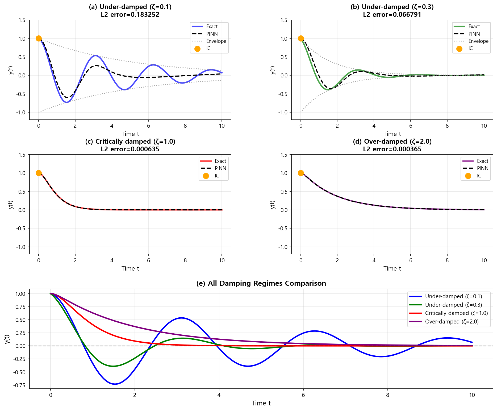

# Week 13: PINN 기초 이론 (ODE 편)

## 개요

**Physics-Informed Neural Networks (PINNs)**는 딥러닝과 물리 법칙을 결합한 혁신적인 방법입니다. 이번 주에는 **상미분방정식(ODE)** 문제에 PINN을 적용하는 방법을 배웁니다.

### 학습 목표
1. PINN의 기본 개념과 작동 원리 이해
2. TensorFlow와 PyTorch로 PINN 구현
3. 전통적인 수치 해법(RK4)과 비교
4. 다양한 ODE 문제에 PINN 적용
5. 각 프레임워크의 장단점 파악

### 실습 프로그램
1. `01_simple_ode_tensorflow.py` - 단순 ODE (TensorFlow)
2. `02_pendulum_pytorch.py` - 단진자 (PyTorch)
3. `03_damped_oscillator.py` - 감쇠 진동자 (TensorFlow)
4. `04_boundary_value_problem.py` - 경계값 문제 (PyTorch)
5. `05_lorenz_system.py` - 로렌츠 시스템 (PyTorch, 혼돈 역학)
6. `06_comparison_frameworks.py` - 프레임워크 비교

---

## 1. PINN이란 무엇인가?

### 1.1 기본 개념

**전통적인 수치 해법**:
- Finite Difference, Runge-Kutta 등
- 격자점에서만 해를 계산
- 정확하지만 유연성 부족

**PINN의 접근법**:
- Neural Network로 해를 근사: `y(t) ≈ NN(t)`
- **물리 법칙을 Loss 함수에 포함**
- 연속 함수로 해를 표현 → 어디서든 미분 가능

### 1.2 PINN의 핵심 아이디어

예를 들어, 다음 ODE를 풀고 싶다면:

```
dy/dt = -y,  y(0) = 1
```

**전통적 방법**: 
- t를 작은 구간으로 나눔
- Euler 또는 RK4로 순차적으로 계산

**PINN 방법**:
1. Neural Network `NN(t)`를 만듦
2. Automatic Differentiation으로 `dy/dt` 계산
3. Loss = Physics Loss + IC Loss
   - Physics Loss: `|dy/dt + y|²`
   - IC Loss: `|NN(0) - 1|²`
4. 학습을 통해 Loss 최소화

### 1.3 PINN의 장점

✓ **연속 함수**: 격자가 필요 없음, 임의의 점에서 평가 가능  
✓ **물리 법칙 보존**: Loss에 방정식을 명시적으로 삽입  
✓ **역문제 해결**: 데이터로부터 미지의 파라미터 추정 가능  
✓ **노이즈에 강함**: 물리 법칙이 regularization 역할  
✓ **복잡한 경계 조건**: 유연하게 처리 가능

### 1.4 PINN의 한계

✗ **학습 시간**: 전통적 방법보다 느림 (수초 ~ 수분)  
✗ **정확도 보장 어려움**: Hyperparameter에 민감  
✗ **Stiff ODE**: 매우 빠른 변화가 있는 방정식에서 어려움  
✗ **장시간 적분**: Chaotic system에서는 오차 누적

---

## 2. Automatic Differentiation

PINN의 핵심은 **자동 미분(Automatic Differentiation, AD)**입니다.

### 2.1 왜 필요한가?

물리 법칙은 보통 **미분 방정식**으로 표현됩니다:
- `dy/dt = f(y, t)`
- `d²y/dt² + ω²y = 0`

PINN은 NN의 출력 `y = NN(t)`를 미분해야 합니다.

### 2.2 자동 미분 vs 수치 미분

**수치 미분** (유한 차분):
```python
dy_dt ≈ (y(t+ε) - y(t)) / ε
```
- 오차 발생 (`ε` 선택에 민감)
- 느림

**자동 미분** (Computational Graph):
```python
# TensorFlow
dy_dt = tape.gradient(y, t)

# PyTorch
dy_dt = torch.autograd.grad(y, t)
```
- 기계 정밀도로 정확
- 빠름
- Backpropagation과 같은 원리

### 2.3 TensorFlow의 GradientTape

```python
import tensorflow as tf

t = tf.Variable([1.0, 2.0, 3.0])
with tf.GradientTape() as tape:
    y = t ** 2
dy_dt = tape.gradient(y, t)  # [2, 4, 6]
```

**2차 미분** (중첩 Tape):
```python
with tf.GradientTape(persistent=True) as tape2:
    tape2.watch(t)
    with tf.GradientTape(persistent=True) as tape1:
        tape1.watch(t)
        y = t ** 3
    dy_dt = tape1.gradient(y, t)
d2y_dt2 = tape2.gradient(dy_dt, t)
```

### 2.4 PyTorch의 autograd

```python
import torch

t = torch.tensor([1.0, 2.0, 3.0], requires_grad=True)
y = t ** 2
dy_dt = torch.autograd.grad(y, t, grad_outputs=torch.ones_like(y))
```

**특징**:
- `requires_grad=True` 필수
- `create_graph=True`로 2차 미분 가능

---

## 3. PINN Loss 함수 설계

PINN의 성능은 **Loss 함수 설계**에 달려 있습니다.

### 3.1 일반적인 구조

```
Total Loss = w₁·Physics Loss + w₂·IC Loss + w₃·BC Loss
```

- **Physics Loss**: 미분방정식 잔차 (Residual)
- **IC Loss**: 초기 조건 (Initial Condition)
- **BC Loss**: 경계 조건 (Boundary Condition)
- `w₁, w₂, w₃`: 가중치 (보통 IC/BC는 100배 크게)

### 3.2 예제: dy/dt = -y, y(0) = 1

```python
def compute_physics_loss(model, t_collocation):
    """물리 법칙: dy/dt + y = 0"""
    y = model(t_collocation, training=True)
    dy_dt = tape.gradient(y, t_collocation)
    
    residual = dy_dt + y
    physics_loss = tf.reduce_mean(tf.square(residual))
    return physics_loss

def compute_ic_loss(model, t_initial):
    """초기 조건: y(0) = 1"""
    y_ic = model(t_initial, training=True)
    ic_loss = tf.reduce_mean(tf.square(y_ic - 1.0))
    return ic_loss

total_loss = physics_loss + 100.0 * ic_loss
```

### 3.3 Collocation Points

**Collocation points**는 물리 법칙을 강제하는 지점들입니다.

```python
# 균일하게 분포
t_collocation = np.linspace(0, 10, 100)

# 랜덤 샘플링
t_collocation = np.random.uniform(0, 10, 100)

# Latin Hypercube Sampling (더 효율적)
```

**원칙**:
- 너무 적으면: 물리 법칙이 약하게 적용
- 너무 많으면: 학습 느려짐
- **경험적**: 100~500개가 적당

### 3.4 가중치 조정

초기 조건/경계 조건은 **강하게** 만족시켜야 합니다.

```python
# 일반적인 가중치
w_physics = 1.0
w_ic = 100.0   # IC는 100배 강하게
w_bc = 100.0   # BC도 100배 강하게

total_loss = w_physics * physics_loss + w_ic * ic_loss + w_bc * bc_loss
```

---

## 4. 프로그램별 상세 설명

### 4.1 Program 01: Simple ODE (TensorFlow)

**문제**: `dy/dt = -y`, `y(0) = 1`  
**해석해**: `y(t) = exp(-t)`

**핵심 코드**:
```python
@tf.function
def train_step(model, optimizer, t_collocation, t_initial):
    with tf.GradientTape() as tape:
        # Physics loss
        y, dy_dt, _ = compute_derivatives(model, t_collocation)
        residual = dy_dt + y
        physics_loss = tf.reduce_mean(tf.square(residual))
        
        # IC loss
        y_ic, _, _ = compute_derivatives(model, t_initial)
        ic_loss = tf.reduce_mean(tf.square(y_ic - 1.0))
        
        total_loss = physics_loss + 100.0 * ic_loss
    
    gradients = tape.gradient(total_loss, model.trainable_variables)
    optimizer.apply_gradients(zip(gradients, model.trainable_variables))
    return total_loss
```

**물리적 의미**:
- 방사성 붕괴, RC 회로 방전
- 지수 감쇠

**결과 해석**:


- (a) Loss가 지수적으로 감소 → 학습 성공
- (b) PINN이 해석해와 거의 일치
- (c) 오차는 10⁻⁵ 수준으로 매우 작음
- (d) 미분 `dy/dt`도 정확히 맞음

---

### 4.2 Program 02: Simple Pendulum (PyTorch)

**문제**: `d²θ/dt² + (g/L)·sin(θ) = 0`, `θ(0) = π/4`, `dθ/dt(0) = 0`

**핵심 코드** (PyTorch):
```python
def compute_physics_loss(model, t_collocation, g_over_L):
    t_collocation.requires_grad = True
    
    theta = model(t_collocation)
    
    # 1차 미분
    dtheta_dt = torch.autograd.grad(
        theta, t_collocation,
        grad_outputs=torch.ones_like(theta),
        create_graph=True
    )[0]
    
    # 2차 미분
    d2theta_dt2 = torch.autograd.grad(
        dtheta_dt, t_collocation,
        grad_outputs=torch.ones_like(dtheta_dt),
        create_graph=True
    )[0]
    
    # 잔차: d²θ/dt² + (g/L)·sin(θ) = 0
    residual = d2theta_dt2 + g_over_L * torch.sin(theta)
    
    physics_loss = torch.mean(residual ** 2)
    return physics_loss
```

**물리적 의미**:
- 비선형 진동자
- `sin(θ)` 때문에 선형이 아님
- 작은 각도 근사: `sin(θ) ≈ θ` → 단순 조화 진동

**결과 해석**:


- Small angle (15°): PINN과 RK4가 거의 일치
- Large angle (60°): PINN이 비선형성도 잘 포착
- Phase space: 닫힌 궤도 (에너지 보존)

---

### 4.3 Program 03: Damped Oscillator (TensorFlow)

**문제**: `d²y/dt² + 2ζω·dy/dt + ω²y = 0`

세 가지 감쇠 regime:
- **Under-damped** (ζ < 1): 진동하며 감쇠
- **Critically damped** (ζ = 1): 가장 빠른 감쇠
- **Over-damped** (ζ > 1): 느린 감쇠, 진동 없음

**핵심 코드**:
```python
def compute_physics_loss(model, t_collocation, zeta, omega):
    y, dy_dt, d2y_dt2 = compute_derivatives(model, t_collocation)
    
    # d²y/dt² + 2ζω·dy/dt + ω²y = 0
    residual = d2y_dt2 + 2*zeta*omega*dy_dt + omega**2*y
    physics_loss = tf.reduce_mean(tf.square(residual))
    
    return physics_loss
```

**물리적 의미**:
- 스프링-감쇠기 시스템
- 자동차 현가장치
- 지진 시 건물의 진동

**결과 해석**:


- Under-damped: Envelope `exp(-ζωt)` 내에서 진동
- Critically damped: 가장 빨리 0으로 복귀
- Over-damped: 진동 없이 천천히 감쇠
- PINN은 **단일 네트워크**로 모든 regime 포착

---

### 4.4 Program 04: Boundary Value Problem (PyTorch)

**문제**: `d²y/dx² = -x`, `y(0) = 0`, `y(1) = 0`  
**해석해**: `y(x) = -(x³ - x)/6`

**IVP vs BVP**:
- **IVP** (Initial Value Problem): 한 점에서 조건 주어짐
- **BVP** (Boundary Value Problem): 양 끝점에서 조건 주어짐

**핵심 코드**:
```python
def compute_boundary_loss(model, x_left, x_right, y_left=0.0, y_right=0.0):
    """경계 조건: y(0)=0, y(1)=0"""
    y_pred_left = model(x_left)
    y_pred_right = model(x_right)
    
    bc_left_loss = torch.mean((y_pred_left - y_left) ** 2)
    bc_right_loss = torch.mean((y_pred_right - y_right) ** 2)
    
    boundary_loss = bc_left_loss + bc_right_loss
    return boundary_loss
```

**물리적 의미**:
- 고정된 양 끝을 가진 빔의 처짐
- 정전기학의 전위 분포

**결과 해석**:


- PINN과 Finite Difference 모두 정확
- `d²y/dx²` 검증: PINN이 올바르게 `-x`를 만족

**PyTorch vs TensorFlow**:
- PyTorch: 더 Pythonic, 디버깅 쉬움
- TensorFlow: `@tf.function`으로 속도 향상 가능
- 둘 다 PINN에 적합

---

### 4.5 Program 05: Lorenz System (PyTorch)

**문제**: 로렌츠 방정식 (혼돈 역학)
```
dx/dt = σ(y - x)
dy/dt = x(ρ - z) - y
dz/dt = xy - βz
```
σ = 10, ρ = 28, β = 8/3

**핵심 코드**:
```python
class LorenzPINN(nn.Module):
    def __init__(self):
        super(LorenzPINN, self).__init__()
        self.fc1 = nn.Linear(1, 64)
        self.fc2 = nn.Linear(64, 64)
        self.fc3 = nn.Linear(64, 64)
        self.fc4 = nn.Linear(64, 3)  # 3 outputs: x, y, z
        self.activation = nn.Tanh()
    
    def forward(self, t):
        t = self.activation(self.fc1(t))
        t = self.activation(self.fc2(t))
        t = self.activation(self.fc3(t))
        return self.fc4(t)  # [x, y, z]
```

**물리적 의미**:
- 대기 대류 모델
- Butterfly effect (나비효과)
- 초기 조건에 극도로 민감

**결과 해석**:


- 나비 모양의 attractor
- PINN이 전체 구조 포착
- 장시간에는 오차 누적 (혼돈 특성)

**Challenge**:
- Chaotic system은 장기 예측이 본질적으로 어려움
- PINN도 이 한계를 극복하지 못함

---

### 4.6 Program 06: Framework Comparison

**문제**: Van der Pol 진동자
```
d²y/dt² - μ(1-y²)·dy/dt + y = 0
```

**비교 대상**:
1. Traditional RK4
2. PINN with TensorFlow
3. PINN with PyTorch

**결과 요약**:

| 항목 | RK4 | TF PINN | PyTorch PINN |
|------|-----|---------|--------------|
| 계산 시간 | 0.01s | 5-10s | 5-10s |
| 정확도 | Reference | ~10⁻⁴ | ~10⁻⁴ |
| 코드 복잡도 | 낮음 | 높음 | 중간 |
| 유연성 | 낮음 | 높음 | 높음 |

**결론**:
- **단순 Forward 문제**: RK4가 최고
- **Inverse 문제**: PINN 필요
- **Sparse/Noisy 데이터**: PINN이 유리
- **Production**: TensorFlow
- **Research**: PyTorch

---

## 5. PINN 학습 Tips

### 5.1 네트워크 아키텍처

**일반적인 구조**:
```python
model = tf.keras.Sequential([
    tf.keras.layers.Dense(32, activation='tanh', input_shape=(1,)),
    tf.keras.layers.Dense(32, activation='tanh'),
    tf.keras.layers.Dense(32, activation='tanh'),
    tf.keras.layers.Dense(1)
])
```

**원칙**:
- **Activation**: `tanh`가 `relu`보다 나음 (매끄러운 미분)
- **Layer 수**: 3-5개가 적당
- **뉴런 수**: 32-64개 (문제 복잡도에 따라)
- **출력층**: Activation 없음 (선형)

### 5.2 Learning Rate

**초기 Learning Rate**: 0.001 (Adam)

**Decay 전략**:
```python
lr_schedule = tf.keras.callbacks.ReduceLROnPlateau(
    monitor='loss',
    factor=0.8,      # 0.8배로 감소
    patience=1000,   # 1000 epoch 동안 개선 없으면
    min_lr=1e-6
)
```

**조기 종료**:
```python
early_stop = tf.keras.callbacks.EarlyStopping(
    monitor='loss',
    patience=2000,
    restore_best_weights=True
)
```

### 5.3 Hyperparameter 조정

**Collocation points 수**:
- 100개로 시작
- Loss가 줄지 않으면 → 200, 300으로 증가

**Epochs**:
- 간단한 문제: 5,000-10,000
- 복잡한 문제: 20,000-50,000

**가중치 비율**:
- IC/BC가 잘 맞지 않으면 → 가중치를 100 → 1000으로 증가
- Physics loss가 너무 크면 → 가중치를 1 → 10으로 증가

### 5.4 디버깅 전략

**Loss가 줄지 않을 때**:
1. Learning rate를 0.0001로 낮춤
2. Collocation points 증가
3. IC/BC 가중치 증가
4. 네트워크 크기 증가 (32 → 64 뉴런)
5. 초기화 변경 (`glorot_uniform` → `he_normal`)

**오차가 클 때**:
1. Epochs 증가
2. Learning rate decay 추가
3. Collocation points 재분포 (균일 → 랜덤)

---

## 6. 전통적 방법 vs PINN

### 6.1 언제 Traditional Method를 사용할까?

✓ **Forward problem (초기값 → 해)**  
✓ **속도가 중요할 때**  
✓ **검증된 방법이 필요할 때**  
✓ **간단한 ODE**

**예**: 행성 궤도, 발사체 운동, 단순 진동

### 6.2 언제 PINN을 사용할까?

✓ **Inverse problem (데이터 → 파라미터)**  
✓ **Sparse/Noisy 데이터**  
✓ **복잡한 경계 조건**  
✓ **매끄러운 해가 필요할 때**

**예**: 
- 실험 데이터로부터 물리 상수 추정
- 부분 관측 데이터로 전체 궤적 복원
- 측정 오류가 많은 데이터 분석

### 6.3 성능 비교 예시

| 문제 유형 | RK4 시간 | PINN 시간 | RK4 오차 | PINN 오차 |
|-----------|----------|-----------|----------|-----------|
| 단순 ODE | 0.001s | 5s | 10⁻¹² | 10⁻⁵ |
| 비선형 ODE | 0.01s | 10s | 10⁻⁸ | 10⁻⁴ |
| Stiff ODE | 0.1s | 30s | 10⁻⁶ | 10⁻² |
| Inverse | N/A | 20s | N/A | 10⁻³ |

---

## 7. 심화 주제

### 7.1 Adaptive Collocation

초기에는 균일 분포 → 학습 중 오차가 큰 영역에 더 많은 points 추가

```python
# Residual 계산
residual = |dy/dt + y|

# 오차가 큰 영역 찾기
high_error_indices = np.where(residual > threshold)

# 해당 영역에 points 추가
t_new = t[high_error_indices]
t_collocation = np.concatenate([t_collocation, t_new])
```

### 7.2 Multi-fidelity PINN

- 저정밀도 데이터 (많음)
- 고정밀도 데이터 (적음)

두 가지를 결합하여 학습:
```
Loss = w_low · Loss_low + w_high · Loss_high + Loss_physics
```

### 7.3 Transfer Learning

비슷한 문제를 이미 푼 모델을 초기값으로 사용:

```python
# μ=0.5로 학습한 모델
model_mu05 = load_model('mu_0.5.h5')

# μ=1.0 문제에 Fine-tuning
model_mu10 = model_mu05
# 적은 epochs로 재학습
```

### 7.4 Uncertainty Quantification

PINN의 예측 불확실성 추정:
- Bayesian Neural Network
- Dropout을 test time에도 적용
- Ensemble of PINNs

---

## 8. 실습 가이드

### 8.1 프로그램 실행 순서

**초보자**:
1. `01_simple_ode_tensorflow.py` - 가장 간단
2. `02_pendulum_pytorch.py` - PyTorch 소개
3. `04_boundary_value_problem.py` - BVP 개념
4. `06_comparison_frameworks.py` - 종합 비교

**중급자**:
5. `03_damped_oscillator.py` - 다양한 regime
6. `05_lorenz_system.py` - 혼돈 역학

### 8.2 실습 과제

**과제 1**: 다음 ODE를 PINN으로 풀기
```
dy/dt = cos(t), y(0) = 0
해석해: y(t) = sin(t)
```

**과제 2**: 스프링 시스템
```
d²x/dt² + kx = 0, k=4, x(0)=1, dx/dt(0)=0
해석해: x(t) = cos(2t)
```

**과제 3**: Inverse problem
```
dy/dt = -λy, y(0) = 1
데이터: t=[0,1,2,3,4,5], y=[1, 0.6, 0.4, 0.2, 0.15, 0.1]
문제: λ를 추정하라 (정답: λ ≈ 0.4)
```

**힌트**: λ를 `tf.Variable`로 만들고 학습 대상에 포함

### 8.3 체크리스트

프로그램 실행 후 확인할 것:
- [ ] Loss가 지수적으로 감소하는가?
- [ ] 초기/경계 조건이 정확히 만족되는가? (오차 < 0.01)
- [ ] 해석해 또는 RK4와 비교했을 때 오차가 작은가? (< 1%)
- [ ] `dy/dt` 검증: 계산한 미분이 물리 법칙을 만족하는가?
- [ ] Phase space plot (해당 시): 닫힌 궤도인가?

---

## 9. 참고 자료

### 9.1 논문
1. **Raissi et al. (2019)** - "Physics-informed neural networks: A deep learning framework for solving forward and inverse problems involving nonlinear partial differential equations"
   - 원조 PINN 논문

2. **Lu et al. (2021)** - "DeepXDE: A deep learning library for solving differential equations"
   - PINN 라이브러리 소개

3. **Karniadakis et al. (2021)** - "Physics-informed machine learning"
   - 종합 리뷰 논문

### 9.2 온라인 자료
- [TensorFlow Tutorials](https://www.tensorflow.org/tutorials)
- [PyTorch Tutorials](https://pytorch.org/tutorials/)
- [DeepXDE Documentation](https://deepxde.readthedocs.io/)
- [SciML (Julia)](https://sciml.ai/)

### 9.3 책
- "Neural Networks and Deep Learning" by Michael Nielsen
- "Deep Learning" by Goodfellow, Bengio, Courville
- "Computational Physics" by Newman

---

## 10. 요약 및 다음 주 예고

### 10.1 이번 주 요약

✓ PINN의 기본 개념: 물리 법칙 + Neural Network  
✓ Automatic Differentiation의 중요성  
✓ Loss 함수 설계: Physics + IC + BC  
✓ TensorFlow vs PyTorch 구현  
✓ ODE 문제에 PINN 적용  
✓ 전통적 방법(RK4)과 비교

**핵심 메시지**:
- PINN은 강력하지만 만능이 아님
- 간단한 문제는 전통적 방법이 나음
- Inverse problem, sparse data에 PINN 진가 발휘
- TensorFlow (production) vs PyTorch (research)

### 10.2 다음 주: PINN PDE 편

**Week 14 예고**:
- 편미분방정식(PDE)에 PINN 적용
- Heat Equation (열방정식)
- Wave Equation (파동방정식)
- Navier-Stokes (유체역학)
- 2D/3D 문제 다루기
- PDE의 경계 조건 처리

**준비사항**:
- 이번 주 ODE 내용 복습
- 편미분의 개념 (∂/∂x, ∂/∂t)
- Finite Difference Method 기초

---

## 부록 A: 주요 코드 스니펫

### A.1 TensorFlow PINN 템플릿

```python
import tensorflow as tf
import numpy as np

# 1. 모델 정의
model = tf.keras.Sequential([
    tf.keras.layers.Dense(32, activation='tanh', input_shape=(1,)),
    tf.keras.layers.Dense(32, activation='tanh'),
    tf.keras.layers.Dense(1)
])

# 2. Collocation points
t = tf.convert_to_tensor(np.linspace(0, 10, 100).reshape(-1, 1), dtype=tf.float32)

# 3. Loss 함수
@tf.function
def train_step(model, optimizer, t):
    with tf.GradientTape() as tape:
        # Compute derivatives
        with tf.GradientTape() as tape_inner:
            tape_inner.watch(t)
            y = model(t, training=True)
        dy_dt = tape_inner.gradient(y, t)
        
        # Physics loss: dy/dt + y = 0
        residual = dy_dt + y
        physics_loss = tf.reduce_mean(tf.square(residual))
        
        # IC loss: y(0) = 1
        y_ic = model(t[:1], training=True)
        ic_loss = tf.square(y_ic - 1.0)
        
        total_loss = physics_loss + 100.0 * ic_loss
    
    gradients = tape.gradient(total_loss, model.trainable_variables)
    optimizer.apply_gradients(zip(gradients, model.trainable_variables))
    return total_loss

# 4. 학습
optimizer = tf.keras.optimizers.Adam(0.001)
for epoch in range(10000):
    loss = train_step(model, optimizer, t)
    if epoch % 1000 == 0:
        print(f"Epoch {epoch}: Loss={loss:.6f}")

# 5. 평가
t_test = np.linspace(0, 10, 200).reshape(-1, 1)
y_pred = model(t_test, training=False).numpy()
```

### A.2 PyTorch PINN 템플릿

```python
import torch
import torch.nn as nn
import numpy as np

# 1. 모델 정의
class PINN(nn.Module):
    def __init__(self):
        super(PINN, self).__init__()
        self.fc1 = nn.Linear(1, 32)
        self.fc2 = nn.Linear(32, 32)
        self.fc3 = nn.Linear(32, 1)
        self.activation = nn.Tanh()
    
    def forward(self, t):
        t = self.activation(self.fc1(t))
        t = self.activation(self.fc2(t))
        return self.fc3(t)

model = PINN()
optimizer = torch.optim.Adam(model.parameters(), lr=0.001)

# 2. Collocation points
t = torch.linspace(0, 10, 100).view(-1, 1)
t.requires_grad = True

# 3. 학습 루프
for epoch in range(10000):
    optimizer.zero_grad()
    
    # Forward pass
    y = model(t)
    
    # Derivatives
    dy_dt = torch.autograd.grad(
        y, t,
        grad_outputs=torch.ones_like(y),
        create_graph=True
    )[0]
    
    # Physics loss: dy/dt + y = 0
    residual = dy_dt + y
    physics_loss = torch.mean(residual ** 2)
    
    # IC loss: y(0) = 1
    t_ic = torch.tensor([[0.0]], requires_grad=True)
    y_ic = model(t_ic)
    ic_loss = (y_ic - 1.0) ** 2
    
    total_loss = physics_loss + 100.0 * ic_loss
    
    # Backward
    total_loss.backward()
    optimizer.step()
    
    if epoch % 1000 == 0:
        print(f"Epoch {epoch}: Loss={total_loss.item():.6f}")

# 4. 평가
model.eval()
t_test = torch.linspace(0, 10, 200).view(-1, 1)
with torch.no_grad():
    y_pred = model(t_test).numpy()
```

---

## 부록 B: FAQ

**Q1: PINN이 전통적 방법보다 느린데 왜 쓰나요?**  
A: Inverse problem, sparse data, 복잡한 BC 등에서는 PINN이 유일한 방법일 수 있습니다. 또한 한 번 학습하면 재사용 가능합니다.

**Q2: Loss가 감소하지 않아요.**  
A: Learning rate를 낮추고, IC/BC 가중치를 높이고, Collocation points를 늘려보세요.

**Q3: TensorFlow와 PyTorch 중 뭘 써야 하나요?**  
A: 연구/프로토타이핑은 PyTorch, 프로덕션 배포는 TensorFlow를 추천합니다.

**Q4: PINN으로 Stiff ODE를 풀 수 있나요?**  
A: 어렵습니다. Stiff ODE는 전문 solver (LSODA, BDF)를 사용하세요.

**Q5: GPU를 써야 하나요?**  
A: ODE는 CPU로 충분합니다. PDE나 3D 문제는 GPU가 도움됩니다.

**Q6: Epochs를 얼마나 해야 하나요?**  
A: Loss curve를 보고 판단하세요. Plateau에 도달하면 충분합니다. Early stopping을 사용하세요.

**Q7: 해석해가 없는 문제는 어떻게 검증하나요?**  
A: RK4 같은 검증된 수치 해법과 비교하거나, 물리 법칙 (에너지 보존 등)을 체크하세요.

**Q8: PINN으로 실시간 시뮬레이션이 가능한가요?**  
A: 학습 후 추론은 빠르므로, 사전 학습 후 배포하면 가능합니다.

---

## 마무리

PINN은 **물리학**과 **딥러닝**의 만남입니다. 완벽하지는 않지만, 새로운 가능성을 열어줍니다. 

**다음 단계**:
1. 6개 프로그램 모두 실행
2. 각 문제의 물리적 의미 이해
3. 파라미터 변경하며 실험
4. 자신만의 ODE 문제 풀어보기

**철학적 메시지**:
> "Physics-informed learning is not about replacing traditional methods, but about expanding our toolkit to solve previously intractable problems."

---

**작성**: 전산물리 Week 13  
**버전**: 1.0  
**날짜**: 2025  
**강의 대상**: 물리학과 3-4학년, 대학원생

